# Django Blog
A simple, fully-functional blog built with Django and Bootstrap4.

#


#

The live link for the project can be found [HERE]()

#

## Table of Contents
+ [UX](#ux "UX")
  + [Project Purpose](#project-purpose "Project Purpose")
  + [Overview](#overview "Overview")
  + [Audience](#audience "Audience")
  + [Communication](#communication "Communication")
  + [Site Goals](#site-goals "Site Goals")
  + [Current User Goals](#current-user-goals "Current User Goals")
  + [New User Goals](#new-user-goals "New User Goals")
+ [User Stories](#user-stories "User Stories")
  + [Admin Stories](#admin-stories "Admin stories")
  + [User Stories](#user-stories "User stories")
+ [Design](#design "Design")
  + [Site Map](#site-map "Site Map")
  + [Database Scheme](#database-schema "Database Schema")
  + [Typography](#typography "Typography")
+ [Features](#features "Features")
  + [Existing Features](#existing-features "Existing Features")
+ [Testing](#testing "Testing")
  + [Manual Testing](#manual-testing "Manual Testing")
  + [Validator Testing](#validator-testing "Validator Testing")
  + [Unfixed Bugs](#unfixed-bugs "Unfixed Bugs")
+ [Technologies Used](#technologies-used "Technologies Used")
  + [Main Languages Used](#main-languages-used "Main Languages Used")
  + [Frameworks, Libraries & Programs Used](#frameworks-libraries-programs-used "Frameworks, Libraries & Programs Used")
+ [Deployment](#deployment "Deployment")
+ [Credits](#credits "Credits")

#

## UX

### Project Purpose:
The purpose of the project is to get a general idea about the working of Django by learning how to build a blog with all the common functionalities such as registering, posting, commenting, and showing a view count.
Building a blog is an excellent first step to get a good grasp over this open-source web framework, written in Python, that follows the model-view-template architectural pattern.

### Learning Outcomes:
1. Create a database-backed Django project and deploy it to Heroku
2. Host uploaded images on a cloud provider
3. Create class-based views in a Django project
4. Use built-in Django generic views
5. Add an authentication back-end
6. Create custom database models
7. Add extra interactivity with Javascript

### Overview
This Blog application built with Django allows users to create, edit and delete posts, and leave comments on a post.

A blog is a web page that is update on a regular basis. Within a blog, registered users share long-form articles that cover topics the target audience may want to read or learn about. It can also include hyperlinks to internal or external web pages to enhance users' experience. Adding images or videos can also make reading your blog a more engaging experience.

- Pages included
  - Homepage, with a hero image, intro section, featured and latest posts sections, and a parallax divider section
  - Category listing with a widgets column
  - Blog page, with a list of all the blog posts, each paginated on a different page
  - Post page, displaying the post's content 

### Audience
The blog does note have a specific theme and does not target an audience of a certain type or with a specific interest other than that of sharing ideas and points of view, ranging from topics of variuos kinds, being able to assign one or more of the available categories to the posts upon publishing them.
Also, amateur writers may find in the blog the perfect space to cultivate their passion for writing and get feedback from other site users through the comment system. 

### Communication
With a clean, easy to follow layout, the users are guided through the features of the website with an ease of navigation.

### Site Goals
The main goal of a blog is to attract future readers and keep them interested, and to keep current users satisfied and engaged. Coming up with fresh topics can encourage people to keep coming back to the website to read your blog, and register to share their own content and leave comments on posts to be involved in the conversation.

### Current User Goals
Site users purpose is to read about topics they are interested in, and share their views on an individual subject either by posting new content or commenting on existing posts.

### New User Goals
To become instantly engaged with the design of the site, and feel intrigued to explore all it has to offer.

#

## User Stories

**Done:**
### Admin Stories:
#### As the Site Admin:
1. I can add, edit and delete posts so that I can manage the blog content.
2. I can add, edit and delete authors so that I can select which site users can create posts.
3. I can add, edit and delete categories so that I can manage the topics discussed in the blog.

### User Stories:
#### As a Site User:
1. I can register an account so that I can create posts and submit comments.
2. I can view featured and latest posts so that I can recognize what content is either important or has been recently added to the website.
3. I can view a list of all the posts so that I can select which post to open.
4. I can click on a post so that I can read its content.
5. I can edit my posts' details so that I can make corrections or update my posts after they were created.
6. I can delete my posts so that I can remove posts from the website after they were created.
7. As a Site User I can leave comments on a post so that be involved in the conversation.
8. As the Site Admin I can approve or disapprove comments so that I can filter out objectionable comments.
9. I can use the search bar to quickly fetch the posts I am interested in.

**Todo:**
#### As a Site User:
10. I can use the contact form to submit enquiries to the site's staff members.

#

## Design

The blog's design is minimalistic, and almost all elements are in black and white. It contains 3 HTML page templates, all of them in 7 color variants (pink, red, blue, green, blue, violet, sea blue.). The default color variant is grey.

### Site Map

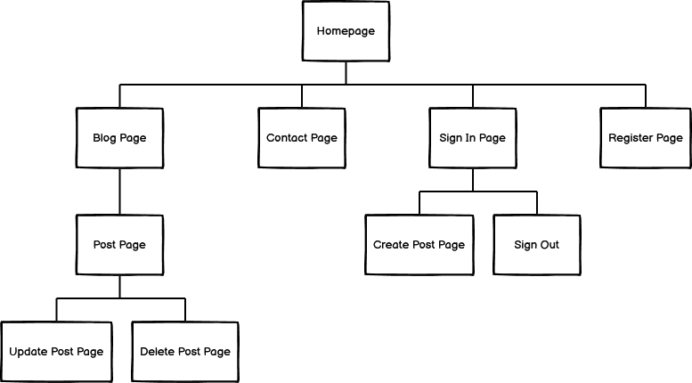

### Database Schema

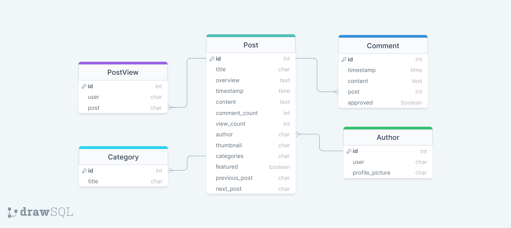


### Typography:
The font used for the website is the "Open Sans - sans-serif", and was obtained from the Google Fonts library.

#

## Features

### Existing Features

#### Homepage

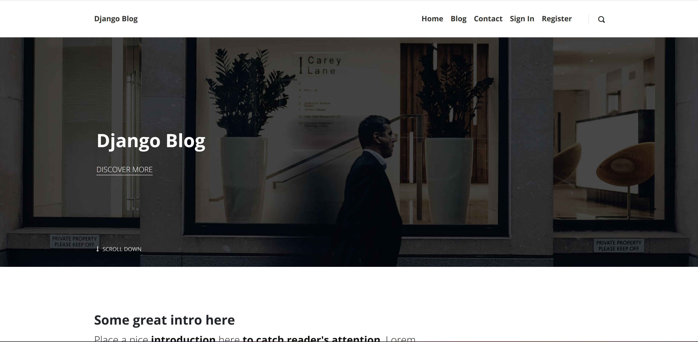

#### Navigation Bar


#### Dropdown Menu

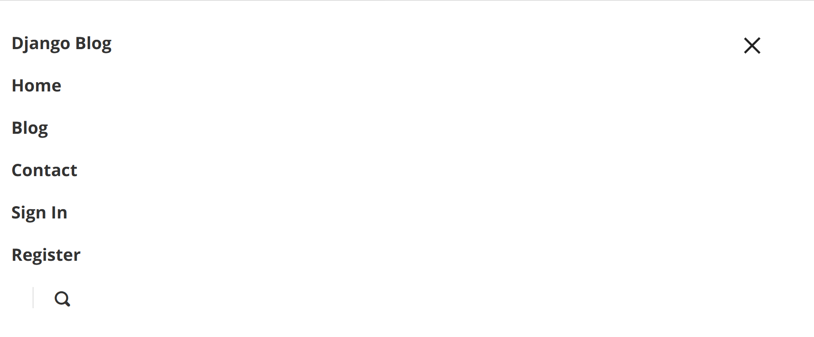

#### Blog Page

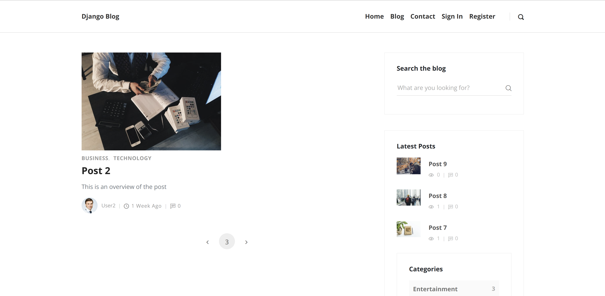

#### Post Page

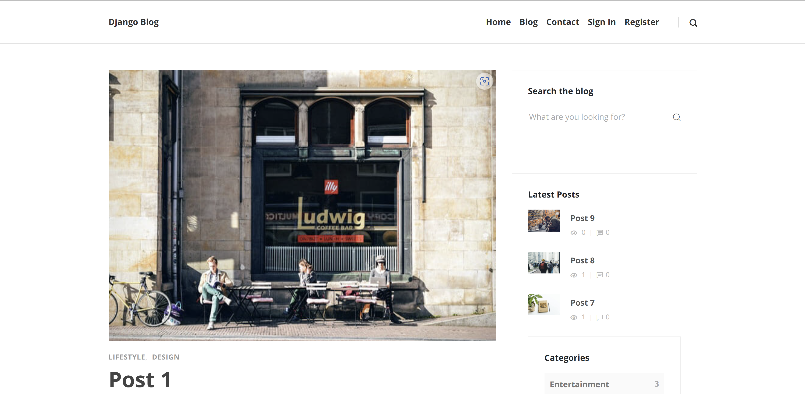

#### Latest Posts & Categories Widgets


#### Search Widget

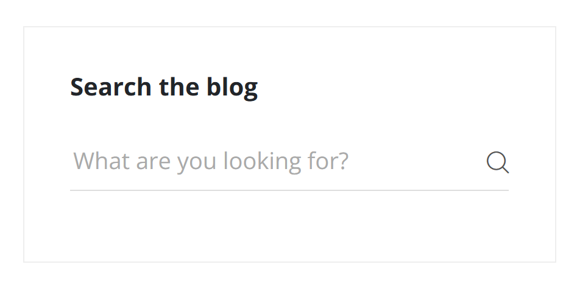

#### Footer

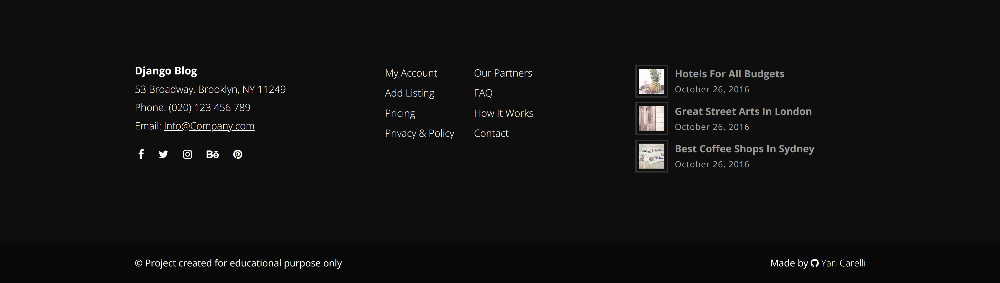

#### Register Page

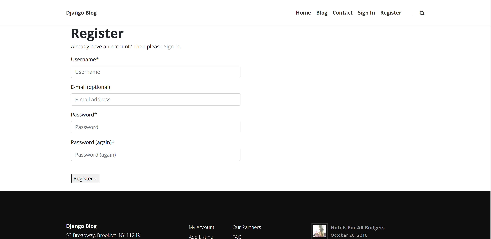

#### Sign In Page

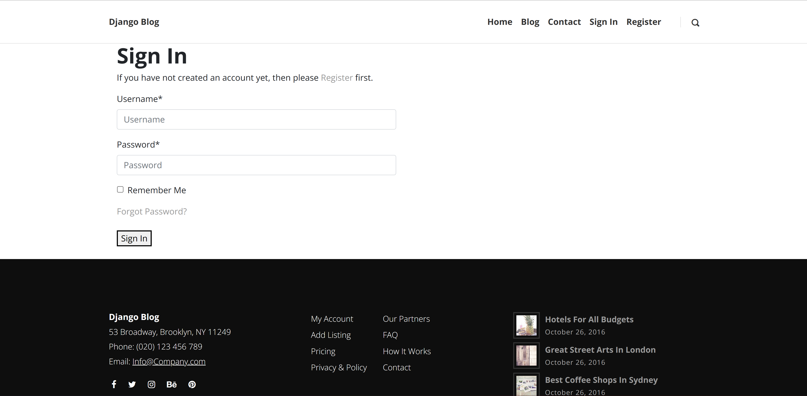

#### Sign Out Page

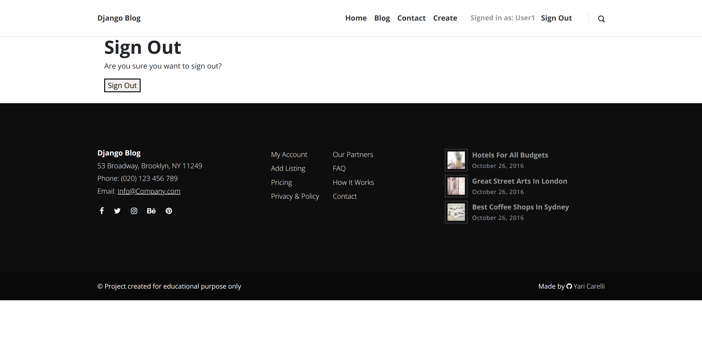

#### Create Post Page

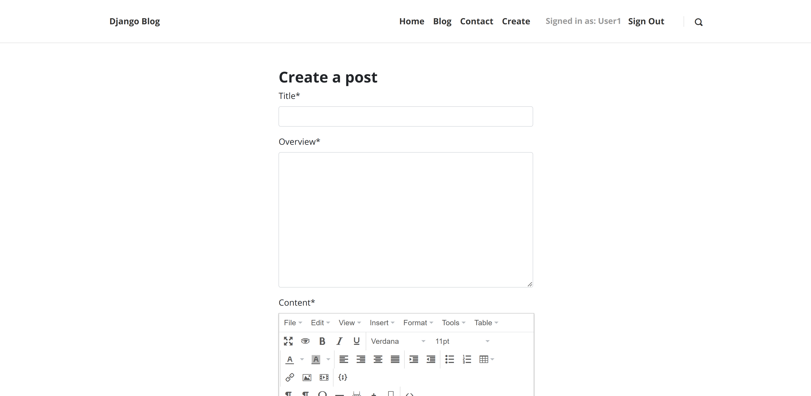

#### Update Post Page

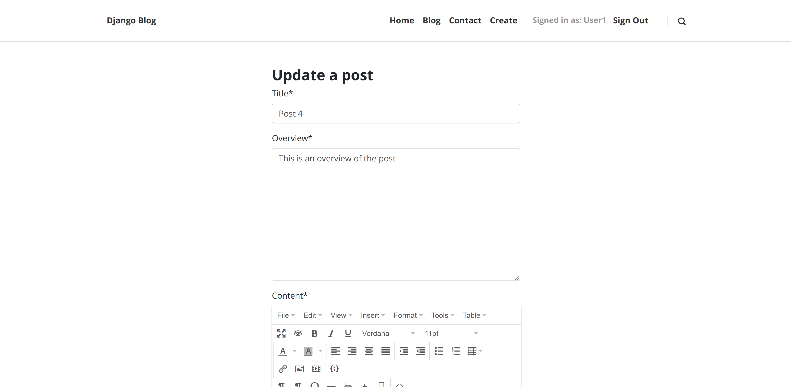

#### Comments Section

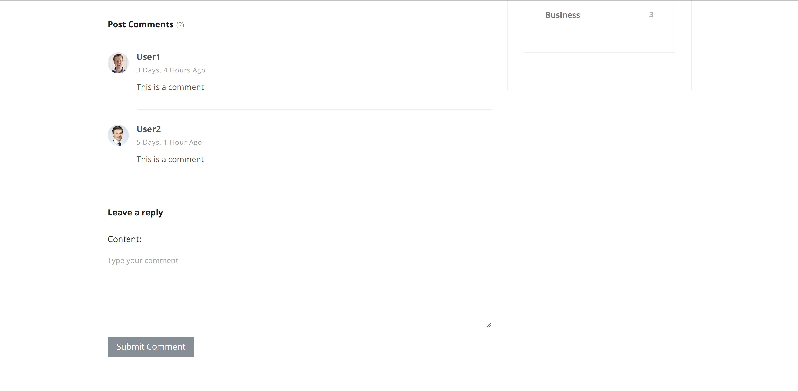

### Features Left to Implement

- Update/Delete comments
- Newsletter subscription form
- Like/Unlike posts/comments
- Tags widget
- Contact form where users can enter their name, email address, and message, and the website will email the message to the staff (with the user's email as the reply-to.)

#

## Testing

### Manual Testing

- CRUD functionality has been tested for each of the Posts.
 - Comments may only be created.
- All navlinks direct to the correct page.
- Buttons to allow users to edit/delete posts only appear on posts that they have created.
- Users are able to register a new account.
- Users with an existing account are able to sign in.
- Each user has the ability to sign out.
- Site tested using different browsers: opens in Brave, Chrome and Safari without issues.
- All social links open to external pages as intended.

### Validator Testing
- html files pass through the [W3C Markup Validation Service](https://validator.w3.org/) with no html issues found
- Errors listed only reference  and {{}} tags.

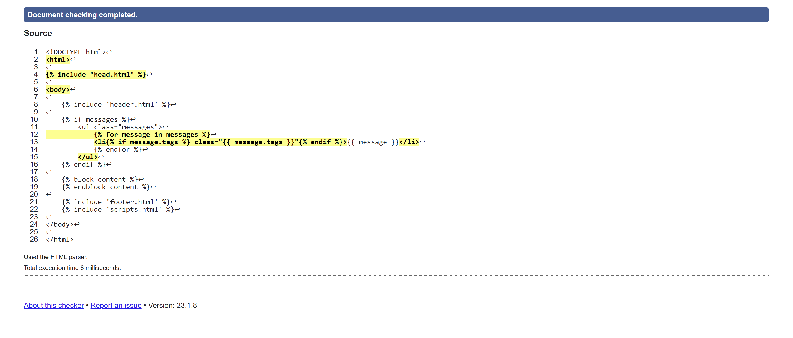

- CSS files pass through the [Jigsaw validator](https://jigsaw.w3.org/css-validator/) with no issues found.

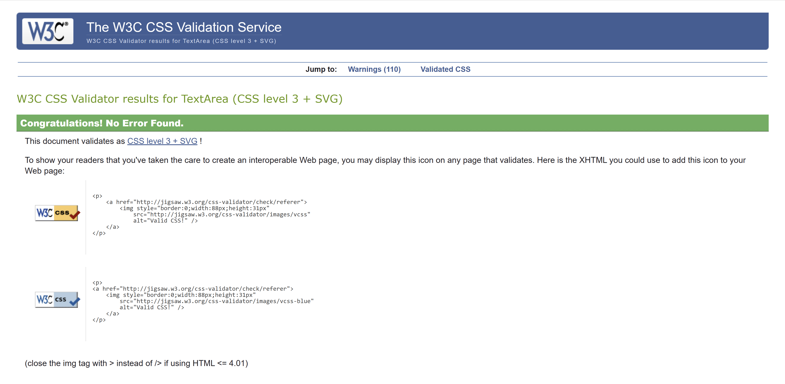

- Python files passed through [CI Python Linter](https://pep8ci.herokuapp.com/) with no issues found.
Results referencing "E501 line too long" errors have been deliberately ignored as they do not affect code functionality.

posts > models.py

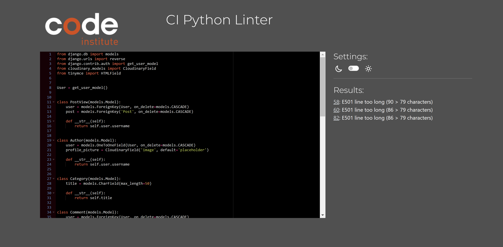

blog > settings.py

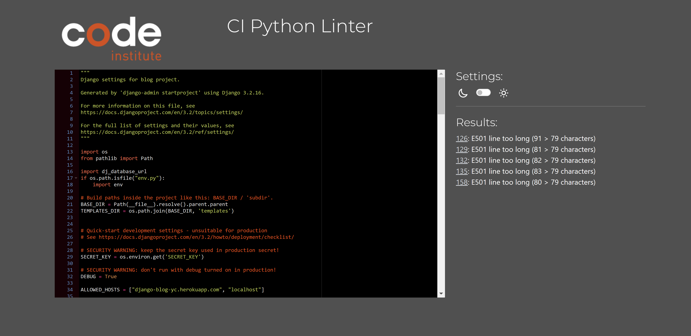

### **Lighthouse Results**

#### Desktop

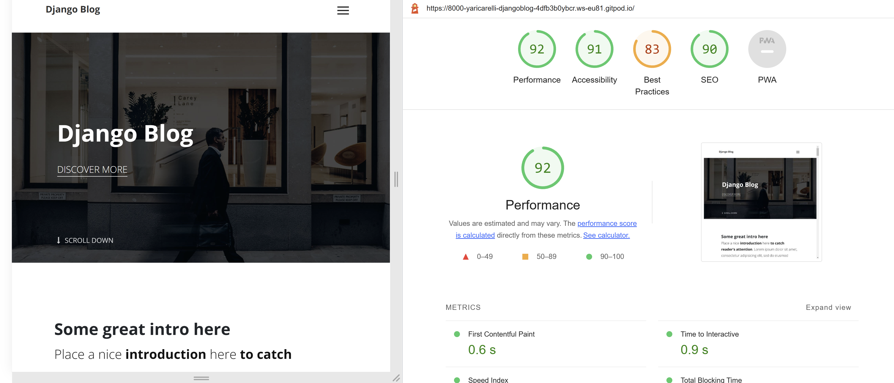

### Mobile

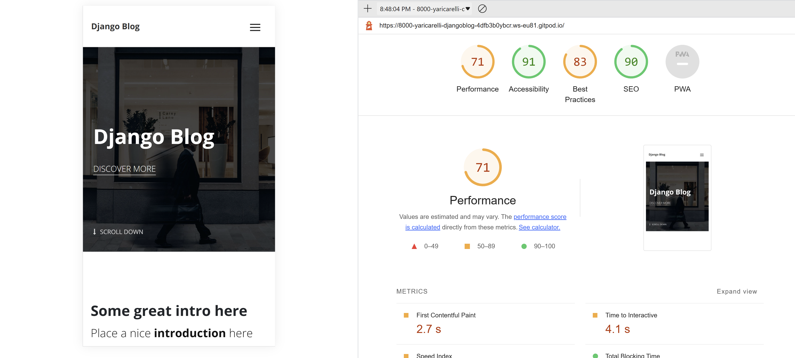


### Unfixed Bugs

To the best of my knowledge, no bugs exist in the website in its current state.

#

## Technologies Used

### Main Languages Used

- HTML5
- CSS3
- Javascript
- Python

### Frameworks, Libraries & Programs Used

- Google Fonts (https://fonts.google.com/)
- Font Awesome (https://fontawesome.com/)
- GitPod
- GitHub (https://github.com/)
- Balsamiq (https://balsamiq.com)
- Am I Responsive? (https://ui.dev/amiresponsive)
- Bootstrap4 (https://getbootstrap.com/)
- Django (https://www.djangoproject.com/)
- DrawSQL (https://drawsql.app/)
- TinyMCE (https://www.tiny.cloud/)
- ElephantSQL (https://www.elephantsql.com/)
- Heroku (https://dashboard.heroku.com/)
- Pexels (https://www.pexels.com/)

### Installed Packages

- 'django<4' gunicorn
- dj_database_url psycopg2
- dj3-cloudinary-storage
- django-allauth [(link)](https://django-allauth.readthedocs.io/en/latest/)
- django-crispy-forms[(link)](https://django-crispy-forms.readthedocs.io/en/latest/index.html)

#

## Deployment

The site was deployed to Heroku following the instructions below.

Django Deployment Instructions:

In the Terminal:
1. Install Django and Gunicorn:
```pip3 install 'django<4' gunicorn```
2. Install supporting libraries:
```pip3 install dj_database_url psycopg2```
3. Install Cloudinary Libraries:
```pip3 install dj3-cloudinary-storage```
4. Create requirements file:
```pip3 freeze --local > requirements.txt```
5. Create Project:
```django-admin startproject PROJECT_NAME .```
6. Create App:
```python3 manage.py startapp APP_NAME```

In settings.py:

7. Add to installed apps:
```
INSTALLED_APPS = [
…
'APP_NAME',
]
```

In the Terminal:

8. Migrate changes:
```python3 manage.py migrate```

On ElephantSQL:

9. Log in to your ElephantSQL account
10. Click “Create New Instance”
11. Set up your plan:
   - Give your plan a Name (this is commonly the name of the project)
   - Select the Tiny Turtle (Free) plan
   - You can leave the Tags field blank
12. Click “Select Region” (Note: If you receive a message saying "Error: No cluster available in your-chosen-data-center yet", choose another region)
13. Click “Review”, then click “Create instance”
14. Return to the ElephantSQL dashboard and click on the database instance name for this project
15. Copy your ElephantSQL database URL using the Copy icon. It will start with postgres://

In Heroku:

16. Create new Heroku App:
```APP_NAME, Location = Europe```
17. Open the "Settings" tab
18. Click "Reveal Congig Vars" (Note: The value should be the ElephantSQL database url you copied in the previous step)

In Gitpod:

19. Create new env.py file on top level directory
20. Import os library
```import os```
21. Set environment variables:
```os.environ["DATABASE_URL"] = "Paste in ElephantSQL database URL"```
22. Add in Secret Key:
```os.environ["SECRET_KEY"] = "Make up your own randomSecretKey"```

In Heroku:

23. Add Secret Key to Config Vars
```SECRET_KEY, “randomSecretKey”```

In settings.py:
24. Reference env.py:
```
import os
import dj_database_url

if os.path.isfile("env.py"):
   import env
```
25. Remove the insecure secret key and replace (links to the SECRET_KEY variable on Heroku)
```SECRET_KEY = os.environ.get('SECRET_KEY')```
26. Comment out the old Databases section:
```
# DATABASES = {
#     'default': {
#         'ENGINE': 'django.db.backends.sqlite3',
#         'NAME': BASE_DIR / 'db.sqlite3',
#     }
# }
```
27. Add new Databases section (links to the DATATBASE_URL variable on Heroku):
```
DATABASES = {
   'default': dj_database_url.parse(os.environ.get("DATABASE_URL"))
}
``` 

In the Terminal:

28. 
```python3 manage.py migrate```

In Cloudinary:

29. Copy your CLOUDINARY_URL:
```From Cloudinary Dashboard```

In env.py:

30. Add Cloudinary URL:
```os.environ["CLOUDINARY_URL"] = "cloudinary://************************"```

In Heroku:

31. Add Cloudinary URL to Heroku Config Vars:
```COUDINARY_URL, cloudinary://************************``` 
32. Add DISABLE_COLLECTSTATIC to Heroku Config Vars (temporary step for the moment, will be removed before deployment)
```DISABLE_COLLECTSTATIC, 1```

In settings.py:

33. Add Cloudinary Libraries to installed apps (Note: order is important):
```
INSTALLED_APPS = [
    …,
    'cloudinary_storage',
    'django.contrib.staticfiles',
    'cloudinary',
    …,
]
```
34. Tell Django to use Cloudinary to store media and static files (place under the Static files note):

```
STATIC_URL = '/static/'

STATICFILES_STORAGE = 'cloudinary_storage.storage.StaticHashedCloudinaryStorage'
STATICFILES_DIRS = [os.path.join(BASE_DIR, 'static')]
STATIC_ROOT = os.path.join(BASE_DIR, 'staticfiles')

MEDIA_URL = '/media/'
DEFAULT_FILE_STORAGE = 'cloudinary_storage.storage.MediaCloudinaryStorage'

```
35. Link file to the templates directory in Heroku
(place under the BASE_DIR line):
```TEMPLATES_DIR = os.path.join(BASE_DIR, 'templates')```
36. Change the templates directory to TEMPLATES_DIR
(place within the TEMPLATES array)

```
TEMPLATES = [
    {
        …,
        'DIRS': [TEMPLATES_DIR],
       …,
            ],
        },
    },
]
```
37. Add Heroku Hostname to ALLOWED_HOSTS:
```ALLOWED_HOSTS = ["PROJ_NAME.herokuapp.com", "localhost"]```

In Gitpod:

38. Create static and templates folders on top level directory
39. Create Procfile on the top level directory

In Procfile:

40. Add code:
```web: gunicorn PROJ_NAME.wsgi```

In the Terminal:

41. After saving all files, add, commit and push:
```git add .```
```git commit -m “...”```
```git push```

In Heroku:

42. Click on "Deploy" tab, select Github as deployment method, on main branch, and deploy content manually

#

## Credits

- Mentor [Martina Terlevic](https://github.com/SephTheOverwitch), a constant source of support, providing reassurance, precious advice and patient guidance.
- Code Institute, for providing the “I think therefore I blog” walkthrough project.
- [Stackoverflow](https://stackoverflow.com), an immense source of solutions to every sort of issue, big or small, and answer to every kind of question, smart or trivial.
